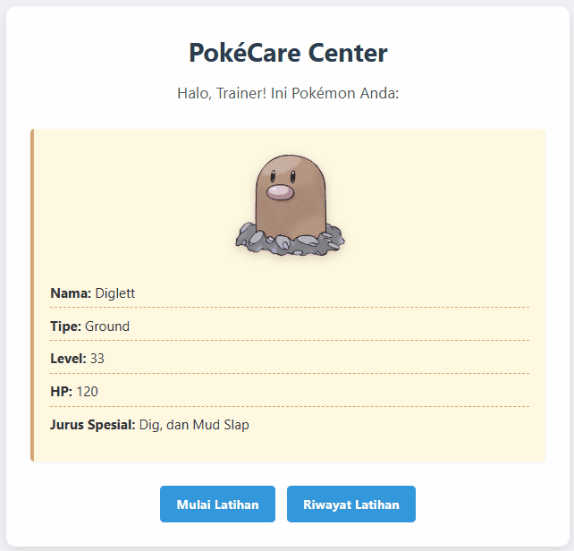

# PokéCare - Diglett Training Simulation

**Responsi Praktikum PBO Teknik Komputer 2025**

Aplikasi simulasi pelatihan Pokémon berbasis web yang dibangun menggunakan **PHP Native** dengan penerapan **4 Pilar Object-Oriented Programming (OOP)**. Proyek ini dibuat untuk memenuhi tugas responsi praktikum PBO.

---

## 👨‍💻 Data Diri Pembuat

* **Nama:** Dedi Kurniawan
* **NIM:** H1H024022
* **Shift Awal:** A
* **Shift Akhir:** D 

---

## 📝 Penjelasan Aplikasi

Aplikasi ini mensimulasikan perawatan dan pelatihan Pokémon bernama **Diglett** (Tipe: Ground). Sebagai trainer, pengguna dapat:
1.  Melihat status terkini Diglett (Level, HP, dan Jurus).
2.  Melatih Diglett dengan berbagai metode (Attack, Defense, Speed).
3.  Melihat riwayat pelatihan yang tersimpan dalam sesi.

Karena Diglett adalah tipe **Ground**, ia memiliki keunikan dalam mekanisme pelatihan (mendapatkan bonus efisiensi saat latihan Defense).

---

## 🛠️ Penerapan Konsep OOP

Kode program ini menerapkan 4 pilar utama OOP:

1.  **Encapsulation (Enkapsulasi)**
    * Property pada class `Pokemon` (seperti `$name`, `$hp`, `$level`) dilindungi menggunakan access modifier `protected` agar tidak bisa diakses sembarangan dari luar.
    * Akses data dilakukan melalui method *getter* (contoh: `getHp()`, `getLevel()`) dan pencatatan riwayat dilakukan melalui method internal `addHistory()`.

2.  **Inheritance (Pewarisan)**
    * Terdapat class `Diglett` yang mewarisi (`extends`) seluruh sifat dan fungsionalitas dari parent class `Pokemon`.
    * Hal ini membuat kode lebih efisien karena tidak perlu menulis ulang logika dasar pelatihan.

3.  **Abstraction (Abstraksi)**
    * Class `Pokemon` didefinisikan sebagai `abstract class`, yang berarti class ini hanya berupa *blueprint* dan tidak bisa diinstansiasi langsung.
    * Terdapat `abstract method specialMove()` yang memaksa setiap class anak (seperti Diglett) untuk mendefinisikan jurus spesialnya sendiri.

4.  **Polymorphism (Polimorfisme)**
    * Class `Diglett` melakukan *override* pada method `train()`. Meskipun menggunakan logika dasar dari parent, Diglett menambahkan logika khusus: jika latihan bertipe 'Defense', intensitas latihan ditambah (bonus tipe Ground).
    * Implementasi `specialMove()` pada Diglett mengembalikan jurus unik "Dig, dan Mud Slap".

---

---
## 🚀 Cara Menjalankan Aplikasi

1.  Pastikan **Laragon** sudah terinstall di komputer Anda.
2.  Clone atau download repository ini.
3.  Pindahkan folder proyek ke dalam direktori **www** milik Laragon (biasanya di `C:\laragon\www\ResponsiPBO25`).
4.  Buka aplikasi Laragon, lalu klik tombol **Start All** untuk menyalakan web server.
5.  Akses aplikasi melalui browser dengan salah satu cara berikut:
    * **Cara 1 (Auto Virtual Host):** Ketik `http://ResponsiPBO25.test` (jika fitur auto host aktif).
    * **Cara 2 (Manual):** Ketik `http://localhost/ResponsiPBO25/index.php`.
      
## 🎥 Demo Aplikasi

